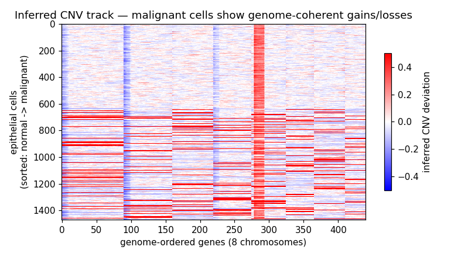
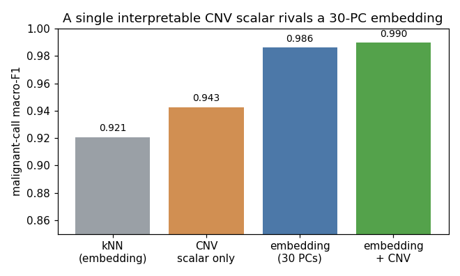

# `sc-tumor-annotator`

 

> **Capability portrait, not a research result.** Public data is intentionally
> replaced with a small, deterministically-generated synthetic cohort so the
> demo is byte-reproducible on a single workstation in well under a minute. No
> patient data, and no proprietary code or parameters, are present in this
> repository.

**What this shows**: a tree-based, *trainable* hierarchical annotator for cancer
single-cell RNA-seq that (1) labels cell types, (2) calls malignant vs normal
epithelial cells, optionally informed by an expression-derived
**copy-number-variation (CNV) score**, and (3) predicts cancer **subtype**
(ER+/HER2+/TNBC) and **grade** (1/2/3) within malignant cells — evaluated under
5-fold cross-validation and an independent-cohort hold-out, with the CNV score's
contribution measured by an explicit ablation rather than assumed.

**Reproducibility**: `make run` produces the metrics artifact in < 1 minute on a
single Mac/Linux box. Everything is seeded.

**Substrate**: emits a hash-chained NDJSON audit ledger, tracks MLflow runs
(no-op when no server is configured), and exposes a deterministic canary the
lab monitoring layer probes daily.

**Production framing**: methods in this *class* — automated tumor-cell
annotation, expression-based CNV inference, and subtype/grade prediction — are
applied at full cohort scale on proprietary data in industry settings. This
repository implements the **method and the engineering** from public building
blocks only (Scanpy, InferCNV, CopyKat, scikit-learn), on synthetic data. It is
a clean-room capability demonstration, not a reproduction of any specific
company's model, dataset, or parameters. See
[`docs/what-is-out-of-scope.md`](docs/what-is-out-of-scope.md).

---

## The capability, in one diagram

```
 scRNA-seq expression (synthetic, genome-ordered genes)
        │
        ├── CNV inference (InferCNV / CopyKat-style)
        │     genome-ordered expression, centered on a stromal
        │     reference, smoothed in a sliding window
        │        │
        │        └── chromosome-LENGTH-NORMALIZED CNV score
        │              (equal weight per chromosome; long
        │               chromosomes do not dominate)
        │
        └── tree-based hierarchical annotator
              1. compartment   : stromal vs epithelial
              2. stromal type  : T / B / Myeloid / Fibroblast / Endothelial
              3. malignant call: normal vs malignant   ← CNV score is a feature
              4. subtype+grade : ER+/HER2+/TNBC ; grade 1/2/3
```

The CNV score is offered as one optional, interpretable feature for the
normal-vs-malignant decision, alongside the transcriptomic embedding. Whether it
improves the call over the embedding alone is treated as an empirical question,
answered by the v0.2 ablation below — not asserted.



*Inferred CNV track on the hard regime — epithelial cells sorted normal → malignant. The malignant block (lower rows) carries genome-coherent gains/losses; normal cells are flat noise.*

---

## Demo results (synthetic data, seed 0)

Run on a 3-patient synthetic cohort (2,100 cells, 440 genes across 8
chromosomes). Macro-F1, tree-based model vs reference-mapping baseline:

| Axis | 5-fold CV (tree) | Independent cohort (tree) | Independent (baseline) |
|---|---|---|---|
| Cell type | 0.998 | 0.998 | 1.000 |
| Malignant call | 1.000 | 1.000 | 1.000 |
| Cancer subtype | 1.000 | 1.000 | 1.000 |
| Cancer grade | **0.938** | **0.910** | 0.874 |

Honest reading: the synthetic data is deliberately *separable*, so both methods
recover cell type, the malignant call, and subtype near-perfectly. The
trainable tree model's margin shows on the hardest axis — **cancer grade**,
driven by a subtle proliferation program — where it beats the CNV-blind
reference-mapping baseline on both CV and the independent cohort. The CNV
score's own discriminative power is verified separately: malignant cells carry
a markedly higher chromosome-length-normalized score than normal cells (the
canary asserts a positive separation; the demo cohort shows ~0.23).

These numbers describe *this synthetic dataset*. They are an illustration of the
method working end-to-end, not a benchmark claim about real cohorts.

## v0.2 — does the CNV channel actually carry the signal? (ablation)

v0.1's separable cohort can't answer that, so v0.2 adds a **hard regime**
(`synth.generate_malignancy_cohort`) where normal and malignant epithelial cells
share an identical transcriptomic baseline and differ *only* by heterogeneous,
sign-varying **subclonal CNV** — and a head-to-head ablation of the malignant
call (macro-F1, 5-fold CV over epithelial cells, seed 0):

| Feature set for the malignant call | macro-F1 |
|---|---|
| kNN reference-mapping (30-PC embedding) | 0.92 |
| **CNV scalar only (1 feature)** | **0.943** |
| Embedding (30 PCs) | 0.986 |
| Embedding + CNV | 0.990 |

Honest reading: a **single, biologically-grounded CNV scalar recovers the
malignant call at 0.94 macro-F1** — within ~4 points of a 30-dimensional
embedding — and adding it to the embedding is non-harmful and slightly additive
(+0.0035). A gradient-boosted tree already recovers much of the CNV magnitude
from the embedding nonlinearly, so the explicit CNV score's value is
**interpretability and compactness**, not a large accuracy jump. The kNN
baseline trails because the sign-heterogeneous alterations leave no single
linear axis to map along. See [`docs/release-notes/v0.2.md`](docs/release-notes/v0.2.md).



---

## Quickstart

```bash
# 1. install (uv preferred; falls back to pip -e .)
make install

# 2. run the end-to-end pipeline -> artifacts/demo.json
make run

# 3. tests
make test

# 4. lint + canary
make lint
make canary
```

`make run` needs no network and no GPU. The pipeline generates its own data.

---

## Layout

```
.
├── README.md
├── LICENSE                      # MIT
├── Makefile                     # install | data | run | test | report | lint | canary
├── pyproject.toml               # pinned deps; [singlecell] extra = scanpy/anndata
├── .github/workflows/
│   ├── ci.yml                   # ruff + pytest + scope-preamble lint + canary
│   └── english-only.yml         # CJK scanner (public artifacts are English-only)
├── data/
│   ├── .gitignore
│   └── manifest.yaml            # public datasets the method targets (not downloaded)
├── src/sctumor/
│   ├── synth.py                 # deterministic synthetic cancer scRNA-seq (+ hard subclonal-CNV regime)
│   ├── cnv.py                   # expression-based CNV inference + length-normalized score
│   ├── annotate.py              # tree-based hierarchical annotator + kNN baseline
│   ├── evaluate.py              # 5-fold CV + independent-cohort harness
│   ├── ablation.py              # CNV-feature ablation on the malignant call
│   ├── adapter.py               # optional real-data bridge (Scanpy/AnnData)
│   ├── pipeline.py              # CLI entry; audit + MLflow shape
│   ├── audit.py                 # hash-chained NDJSON ledger (substrate)
│   ├── tracking.py              # MLflow wrapper (substrate)
│   └── canary.py                # deterministic smoke test (substrate)
├── tests/                       # synth / cnv / annotate / pipeline / canary
└── docs/
    ├── architecture.md
    ├── what-is-out-of-scope.md
    └── release-notes/v0.1.md
```

---

## On real data

The demo is synthetic, but the code is written against a real-data shape. The
public datasets this class of method is designed for are catalogued in
[`data/manifest.yaml`](data/manifest.yaml) (breast-cancer single-cell atlases
and PDAC cohorts from the peer-reviewed literature). To adapt:

1. Load a real cohort into a cells × genes matrix with a gene→chromosome map
   (Scanpy / AnnData; install with `pip install -e ".[singlecell]"`).
2. Use a confidently-normal population (e.g. immune/stromal cells) as the CNV
   reference in `cnv.infer_cnv`.
3. Train `HierarchicalAnnotator` on labeled cells; evaluate with
   `evaluate.cross_validate` / `evaluate.independent_cohort`.

The CNV-inference idea is the public method of InferCNV (Tickle et al.) and
CopyKat (Gao et al., 2021); this repository implements it from scratch. A
concrete plan to ship one real-data demo is in
[`docs/roadmap-v0.3.md`](docs/roadmap-v0.3.md).

## License

MIT. See [`LICENSE`](LICENSE).
